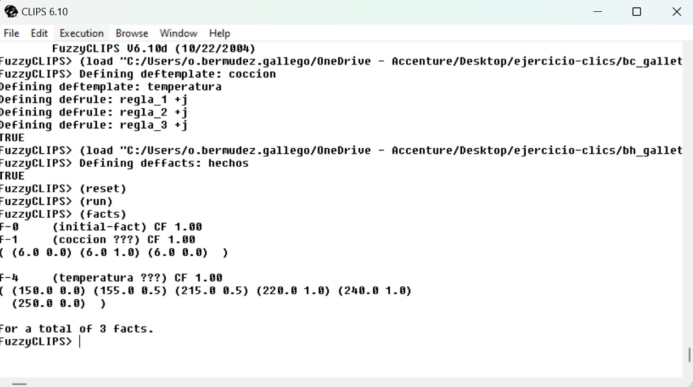

# Sistema Experto en CLIPS para Control Difuso del Horno de Galletas

Este repositorio contiene el ejercicio desarrollado para el "Control difuso de un horno con un sistema experto" implementado en CLIPS. El objetivo del sistema es simular el proceso de ajuste de temperatura de un horno para hornear galletas basado en las reglas proporcionadas por la abuela María y su observación del color de las galletas.

## Descripción del Proyecto
La abuela María hornea galletas artesanalmente y ajusta la temperatura según el estado de las galletas:
- **Un poco crudas:** Temperatura media.
- **Medio hechas:** Temperatura alta.
- **Doraditas:** Temperatura baja.

El sistema experto usa conjuntos difusos para modelar:

### Índice cromático (estado de las galletas)
- **poco_crudas:** `(1/4, 0.5/6, 0/7)`
- **medio_hechas:** `(0/3, 1/5, 1/6, 0/8)`
- **doraditas:** `(0/5, 1/7)`

### Temperatura del horno (en °C)
- **baja:** `(0/150, 1/160, 1/180, 0/190)`
- **media:** `(0/170, 1/190, 1/210, 0/230)`
- **alta:** `(0/210, 1/220, 1/240, 0/250)`

## Archivos
- **`bc_galleta_maria.clp`:** Base de conocimientos con las reglas difusas.
- **`bh_galleta_maria.clp`:** Base de hechos inicial.

## Prueba de Ejecución
El sistema fue probado con un índice cromático inicial de 6. A continuación, se muestra el resultado obtenido al ejecutar el sistema experto en CLIPS:



### Salida del Sistema:
1. Se definen los `deftemplates` y las reglas en `bc_galleta_maria.clp`.
2. Se cargan los hechos desde `bh_galleta_maria.clp`.
3. Tras ejecutar `(run)` y listar los hechos con `(facts)`, el sistema muestra el estado final y las reglas disparadas.

## Cómo Usar
1. **Descarga CLIPS:** Asegúrate de tener instalado CLIPS en tu sistema.
2. **Carga los archivos:**
   ```clips
   (load "bc_galleta_maria.clp")
   (load "bh_galleta_maria.clp")
   ```
3. **Ejecuta el sistema:**
   ```clips
   (reset)
   (run)
   ```
4. **Verifica los hechos:**
   ```clips
   (facts)
   ```

## Requisitos
- Implementar las reglas difusas y calcular la temperatura del horno basada en el índice cromático dado (6 en el ejemplo).
- Usar CLIPS para la definición de las bases de conocimiento y hechos.

## Licencia
Este proyecto fue desarrollado como parte del Máster de FP en Inteligencia Artificial y Big Data. Su uso está limitado a fines académicos.

---
Si tienes alguna pregunta o mejora, no dudes en abrir un issue o hacer un pull request. ¡Gracias por visitar este repositorio!

